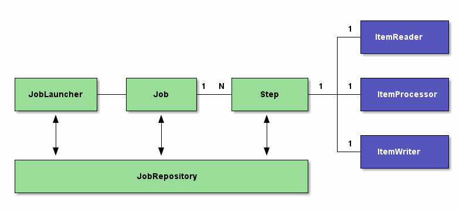

# spring-batch-demo
Batch Processing CSV file with Spring Boot and Spring Batch

This is a simple example of a Spring batch application that demonstrates processing of a csv and storing it into a database.  The application uses an in memory H2 database and can be started from the command line by issuing the following command.

`mvn spring-boot:run`

One can also use an IDE like Eclipse/Intellij and run the Application.java class in com.springbatch.example package

The database can be accessed at the url: http://localhost:8080/h2-console/
 
Details are as follows:

Username: sa

Password: password

JDBC URL: jdbc:h2:mem:batchdemo

# High level architecture
